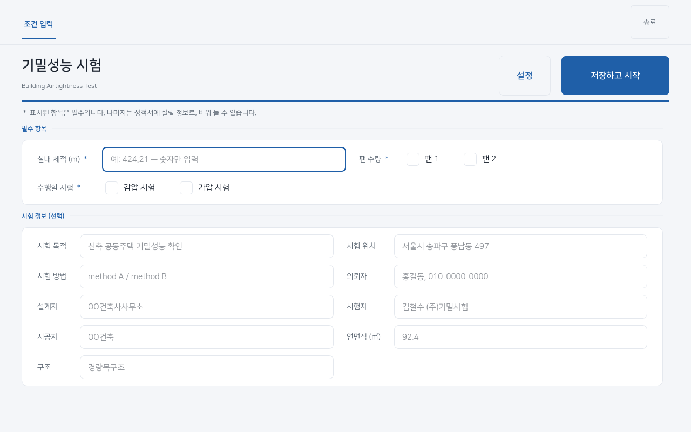
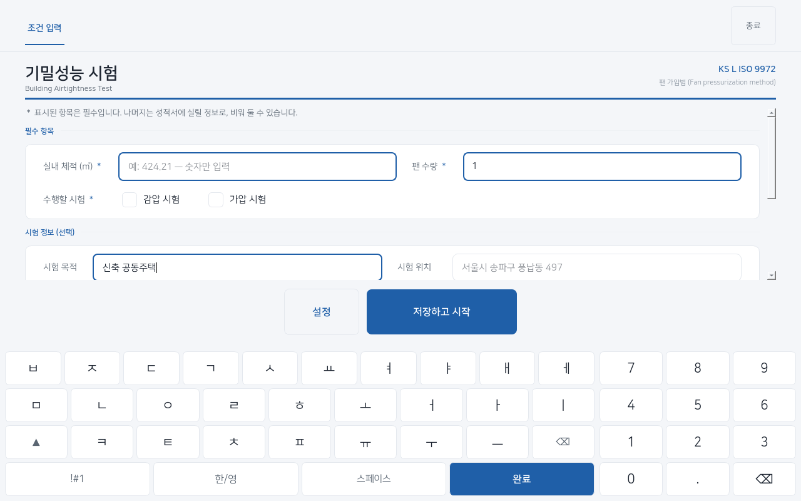
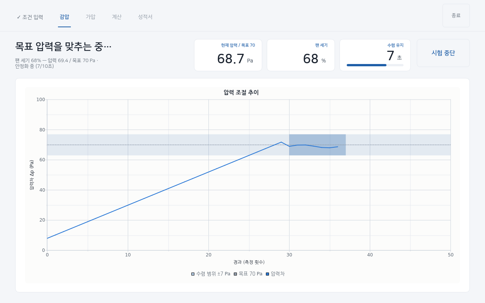
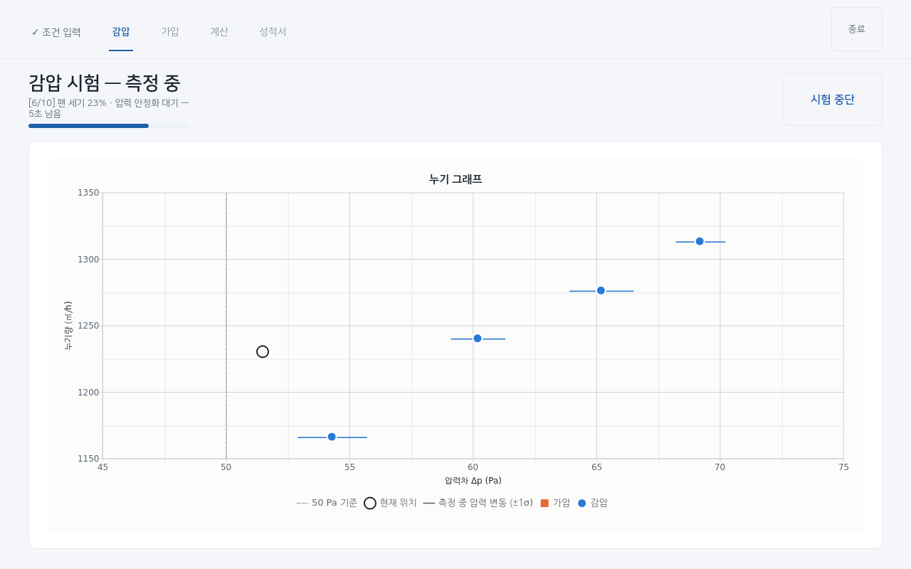
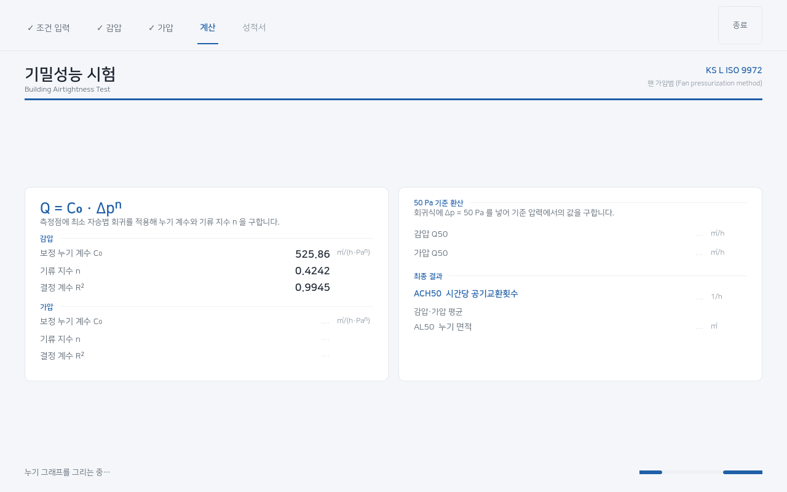
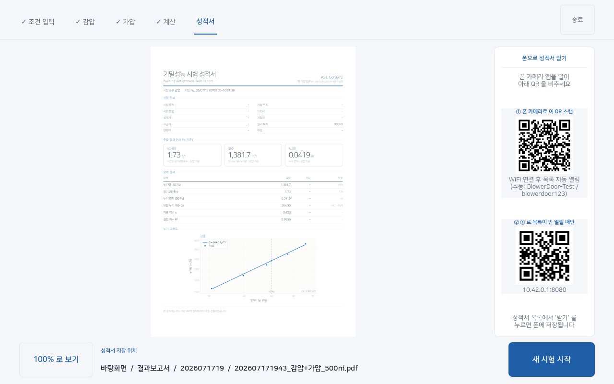
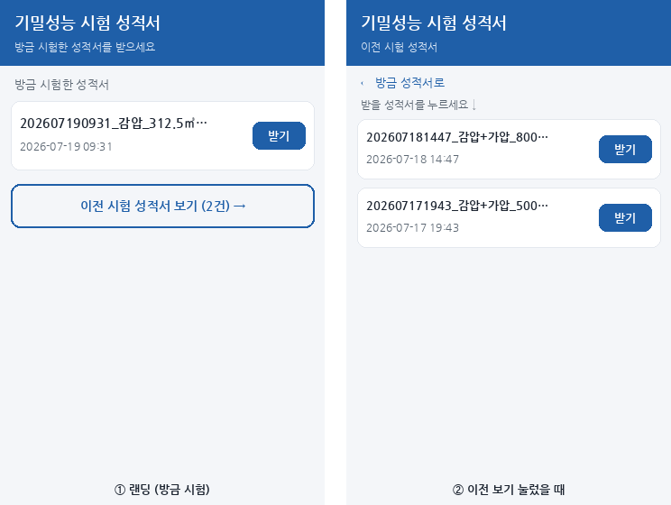
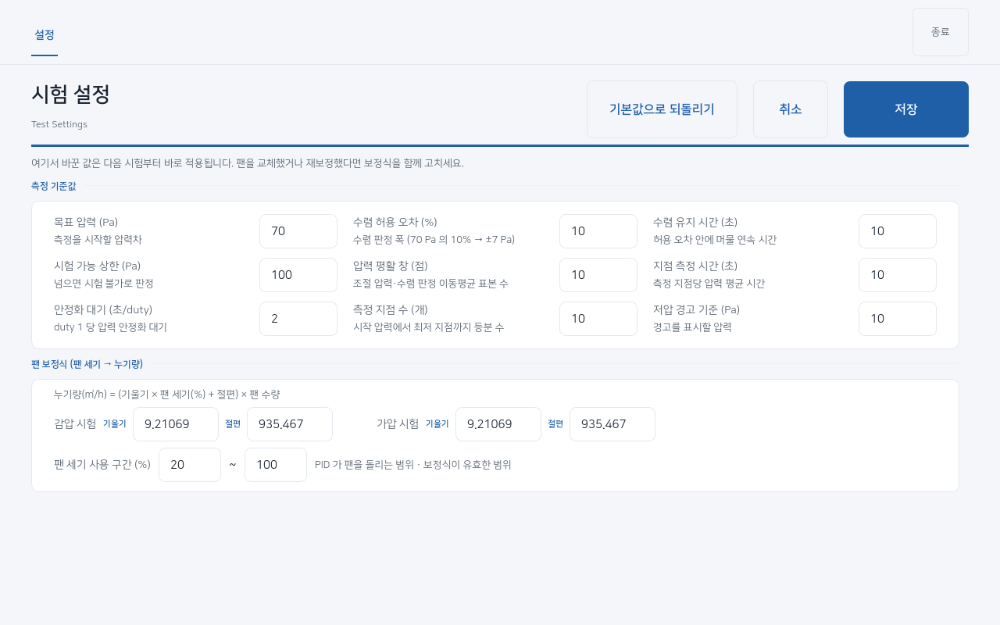
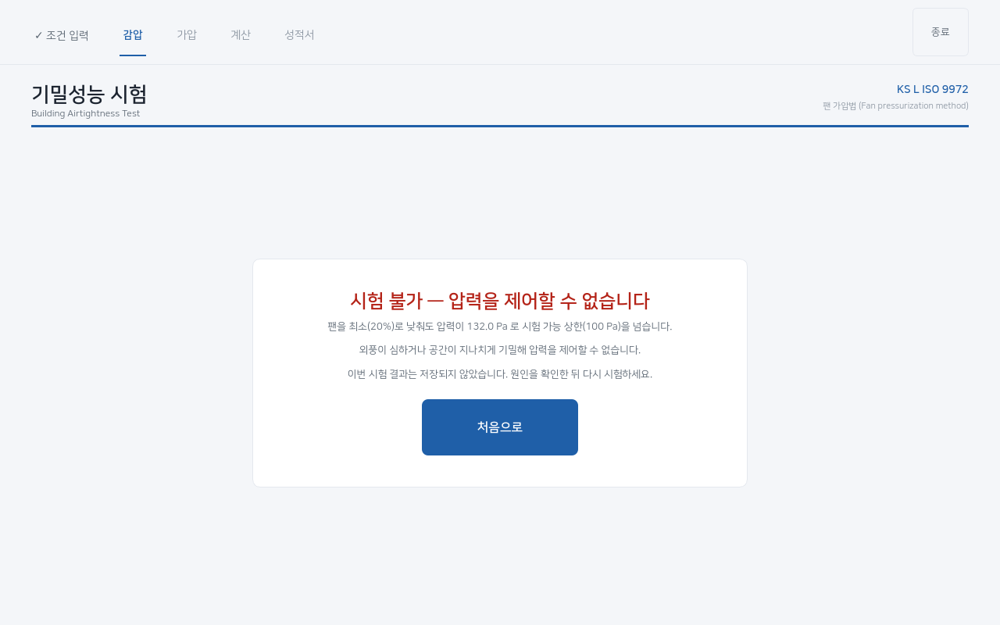

# 기밀성능 시험기 사용·관리 매뉴얼

라즈베리파이5 + 터치스크린 기반 건물 기밀성능 시험기(KS L ISO 9972 준용).
팬으로 실내에 압력차를 만들어 누기량을 재고, 성적서 PDF를 발행한다.

이 매뉴얼은 두 부분이다.
- **1부 사용 설명서** — 현장 작업자용. 시험하고 성적서 받기.
- **2부 관리·설치** — 관리자/설치자용. 서비스·네트워크·안전장치·복구.

---

# 1부. 사용 설명서 (작업자용)

## 1-1. 켜기

전원을 넣으면 앱이 **자동으로 전체화면**으로 뜬다. 별도 조작이 필요 없다.
화면 오른쪽 위 **[종료]** 버튼이 앱을 끄는 유일한 수단이다(전체화면이라 창
닫기 버튼이 없다). 실수로 눌러도 한 번 되묻는다.

> **팬 전원은 수동으로 켠다.** 앱은 시작할 때 팬 세기를 0으로 맞춰 두므로,
> 앱을 먼저 켜고 팬 전원을 올려도 팬이 갑자기 돌지 않는다.

## 1-2. 시험 순서

화면 위쪽에 진행 단계가 표시된다: **조건 입력 → (감압/가압) → 계산 → 성적서**

### ① 조건 입력



- **필수 항목** (파란 테두리): 실내 체적(㎥), 팬 수량, 수행할 시험(감압/가압
  중 하나 이상 선택).
- **시험 정보**(선택): 시험 목적·위치·의뢰자·시험자 등 성적서에 실릴 정보.
  비워 둬도 된다.
- 숫자 칸에 단위·글자를 넣으면 저장할 때 막는다(예: `424.21 ㎥` ✗ → `424.21` ○).
- 아래 **[저장하고 시작]**. 왼쪽 **[설정]** 은 시험 기준값을 바꾼다(1-4 참고).

> **화면 키보드**: 입력 칸을 터치하면 화면 아래에 키보드가 자동으로 뜬다(물리
> 키보드가 없어도 된다). 숫자 칸은 숫자 키패드가, 글자 칸(의뢰자·위치 등)은
> 한글 키보드가 나온다. 글자 칸에서는 **[한/영]** 으로 영문, **[!#1]** 로
> 숫자·특수문자, **[▲]** 로 쌍자음(ㄲ·ㅆ 등)을 넣고, 오른쪽 **텐키**로 숫자를
> 바로 친다. 다 입력하면 **[완료]** 로 키보드를 닫는다. 설정 화면도 같다.



### ② 준비 (영기류 확인)
팬을 멈춘 상태에서 압력이 안정되면 **[측정 시작]** 을 누른다.

### ③ 목표 압력 조절



팬 세기를 높여 목표 압력(기본 70 Pa)을 맞춘다. 화면에 압력이 목표선으로 올라가는
추이가 그려진다. **파란 띠(±허용 오차)** 안에 압력이 **연속으로 유지**되면
'수렴 유지' 카운트가 차오르고, 정해진 시간(기본 10초)을 채우면 자동으로
다음으로 넘어간다. 압력이 띠를 벗어나면 카운트가 0으로 되돌아간다(정상).

### ④ 측정



목표에서 팬 세기를 단계적으로 낮추며 여러 지점의 압력·누기량을 잰다. 각
지점마다 **안정화 대기 → 측정**을 거친다. 남은 시간이 막대로 줄어든다.
현재 위치는 **빈 동그라미**로 표시된다. 잘못됐으면 **[시험 중단]**.

### ⑤ 계산 → 성적서



계산 과정을 잠깐 보여준 뒤 성적서가 화면에 뜬다.

## 1-3. 성적서 받기



성적서 화면에서 세 가지 방법으로 가져갈 수 있다. **PDF는 자동으로 단말
바탕화면 `결과보고서` 폴더에 사본으로 보관**된다(파일명에 시각·시험 종류·
체적: `202607191430_감압+가압_424㎥.pdf`).

### 화면에서 보기
성적서가 화면 가운데에 뜬다. **[100% 로 보기]** 로 확대해 표의 작은 숫자를
확인할 수 있다. 하단에 **저장 위치**가 표시된다.

### USB로 복사
USB 저장소를 꽂으면 **[USB로 복사]** 버튼이 나타난다. 누르면 성적서가
뜻있는 파일명으로 USB에 복사되고, 안전하게 뽑아도 된다는 안내가 뜬다.

### 폰으로 받기 (QR)

폰에 뜨는 화면 — 왼쪽 '방금 시험한 성적서', '이전 시험 성적서 보기'를 누르면 오른쪽 목록:



화면 오른쪽 **폰으로 성적서 받기** 칸의 QR을 쓴다.
1. **① QR을 폰 카메라로 스캔** → 단말 WiFi(`BlowerDoor…`)에 자동 연결
   (비밀번호가 QR에 들어 있어 입력할 필요 없음).
2. 연결되면 **성적서 목록 페이지가 폰에 자동으로 뜬다.** '방금 시험한
   성적서'의 **[받기]** 를 누르면 다운로드된다. '이전 시험 성적서 보기' 로
   지난 성적서도 받을 수 있다.
3. 자동으로 안 뜨면 **② QR**을 스캔한다(폴백).

> 폰은 단말이 만든 WiFi에만 붙으면 된다(인터넷 불필요). 현장에 WiFi가 없어도
> 된다. 같은 WiFi에 붙은 사람은 누구나 성적서를 받을 수 있으니, 의뢰자
> 정보가 담긴 성적서는 신뢰할 수 있는 상황에서 공유한다.

## 1-4. 설정 바꾸기

조건 입력 화면의 **[설정]** 버튼. 바꾼 값은 **다음 시험부터 바로 적용**된다.



| 항목 | 기본값 | 범위 | 설명 |
|---|---|---|---|
| 목표 압력 | 70 Pa | 10~100 | 측정을 시작할 압력차 |
| 수렴 허용 오차 | 10 % | 1~50 | 수렴 판정 폭 (70 Pa의 10% → ±7 Pa) |
| 수렴 유지 시간 | 10 초 | 1~120 | 허용 오차 안에 머물 연속 시간 |
| 시험 가능 상한 | 100 Pa | 10~500 | 넘으면 시험 불가로 판정 |
| 압력 평활 창 | 10 점 | 1~60 | 조절 압력·수렴 판정 이동평균 점수 |
| 지점 측정 시간 | 10 초 | 1~120 | 측정 지점당 압력 평균 시간 |
| 안정화 대기 | 2 초/duty | 0~30 | 팬 세기 1당 압력 안정화 대기 |
| 측정 지점 수 | 10 개 | 5~30 | 시작 압력에서 최저 지점까지 등분 수 |
| 저압 경고 기준 | 10 Pa | 0~50 | 이보다 낮은 측정점에 경고 표시 |

아래쪽 **팬 보정식**(팬 세기→누기량)은 팬을 교체·재보정했을 때만 고친다.
잘못 만지면 결과가 틀어지므로 평소엔 건드리지 않는다. **[기본값으로
되돌리기]** 는 측정 기준값만 되돌리고 팬 보정식은 그대로 둔다.

## 1-5. 시험 불가 화면



팬 세기를 최소로 낮춰도 압력이 **시험 가능 상한(기본 100 Pa)** 을 넘으면 **'시험
불가'** 화면이 뜬다(장비 고장이 아니라 외풍이 심하거나 공간이 지나치게
기밀한 경우). 기상 조건을 확인하고 다시 시도한다. 장비 오류와는 다른
화면이므로 장비를 의심하지 않아도 된다.

---

# 2부. 관리·설치 (관리자용)

## 2-1. 하드웨어 구성

- **라즈베리파이5** + 1280×800 터치스크린. 부팅 시 앱 자동 실행·전체화면.
- **팬 PWM = GPIO13(물리핀 33)**. 커널 sysfs PWM 사용(파이5는 pigpio 불가).
- **압력센서**: /dev/ttyUSB0, Modbus RTU(응답 CRC 검증).
- **USB WiFi 동글(wlan1)**: 개발 중 인터넷용. **납품 시 제거**하고 내장
  wlan0을 성적서 공유 AP로 쓴다(2-3 참고).
- `/boot/firmware/config.txt` 필수 유지: `gpio=13=op,dl`(부팅 초기 LOW),
  `dtoverlay=pwm-2chan,pin=12,func=4,pin2=13,func2=4`, `dtparam=audio=off`.

## 2-2. 상시 서비스 4종

`systemctl status <이름>` 으로 확인. 모두 부팅 시 자동 실행(enabled).

| 서비스 | 역할 |
|---|---|
| `bdt-fan-stop` | 부팅 시 팬 duty 0 고정 (안전 초기화) |
| `bdt-fan-guard` | 1초마다 앱 유무 확인 → **앱이 없으면 팬 duty 0 강제** |
| `bdt-web` | 성적서 로컬 웹 공유 서버 (포트 8080) |
| `bdt-captive` | 캡티브 포털 nftables 리다이렉트 (80→8080) |

앱 자동 실행은 서비스가 아니라 `~/.config/labwc/autostart`(원본 사본은
저장소의 `labwc-autostart`, 로그는 `~/bdt-autostart.log`).

## 2-3. 성적서 공유 네트워크 (핫스팟)

단말이 **자체 WiFi(AP)** 를 띄우고 폰이 거기 붙어 성적서를 받는다.
현장에 WiFi가 없어도 된다.

- **납품 구성**: 동글(wlan1) 제거 후 **내장 wlan0을 AP로**. 현장엔 저장된
  WiFi가 없어 wlan0이 자연히 AP가 된다. 콘솔(모니터·키보드)에서:
  ```
  ./setup-hotspot.sh wlan0
  ```
  (SSID·비번을 바꾸려면: `./setup-hotspot.sh wlan0 새SSID 새비번8자이상`)
- **개발 구성**: 동글(wlan1)로 인터넷을 쓰려면 AP를 wlan1에 둔다
  (`./setup-hotspot.sh wlan1`). 원격 세션이 wlan0 인터넷에 물려 있을 때
  wlan0을 AP로 바꾸면 세션이 끊기니, **AP 인터페이스 전환은 콘솔에서** 한다.
- **동작 원리**: NetworkManager 공유 모드(10.42.0.1 + DHCP) + dnsmasq가 모든
  도메인을 10.42.0.1로(`/etc/NetworkManager/dnsmasq-shared.d/dnsmasq-captive.conf`)
  + nftables가 AP망 80→8080(`bdt-captive.service`). 폰이 붙으면 OS의 인터넷
  확인 요청이 웹서버로 가로채져 성적서 목록이 자동으로 뜬다.
- QR·주소는 `bdt.web`이 AP IP(10.42.0.1)와 SSID·비번을 NetworkManager에서
  읽어 자동 생성한다. AP 설정만 맞으면 화면 QR은 자동으로 따라간다.

## 2-4. 팬 보정 (duty → 누기량)

`fan_coefficients.json` (저장소 루트). 커버별 `slope`·`intercept`(1차식)와
`duty_range`. 현재 팬(9GV2048P0G201)은 비리버서블이라 forward/reverse 계수가
같고 duty_range는 [20,100]. 설정 페이지의 '팬 보정식'으로도 편집할 수 있다.
값을 바꾸면 누기량 계산이 통째로 달라지니 재보정 시에만 건드린다.

## 2-5. 안전장치 (팬)

팬이 도는 채로 방치되지 않게 **다중** 장치를 둔다.
1. `config.txt` 펌웨어 LOW (부팅 최초기)
2. `bdt-fan-stop.service` (부팅 1회)
3. autostart 후행 `python3 -m bdt.fan_stop` (앱 종료 후)
4. `bdt-fan-guard.service` (1초마다 상시 — SIGKILL·비정상 종료 대비)
5. `bdt.hardware`의 atexit (파이썬 프로세스 정상 종료 시)

**duty 0은 항상 안전, duty>0은 실제 팬이 돈다.** 핀 레벨 확인은 `pinctrl get 13`.

## 2-6. 점검·문제 해결

**회귀 스모크(수정 후 항상)**: 하드웨어 없이 앱 핵심 경로를 검증.
```
QT_QPA_PLATFORM=offscreen python3 tests/smoke.py
```
약 1분, 전부 통과 시 종료코드 0. 실데이터·산출물은 백업 후 복원한다.

| 증상 | 확인 |
|---|---|
| 팬이 안 멈춤 | `pinctrl get 13`이 `lo`인지. PWM 핀 손상 의심 시 전원 수동 차단 |
| 압력 −3174 같은 유령값 | 센서 CRC 검증이 원인 제거. 배선·전원 확인 |
| 시험 불가 반복 | 외풍·과도한 기밀. 설정의 '시험 가능 상한' 확인 |
| 성적서 화면에 옛것 | pdftoppm 렌더 실패 시 '표시 못 함' 뜸. PDF는 저장됨 |
| 폰이 성적서 못 받음 | `systemctl status bdt-web bdt-captive`, AP(bdt-share) 활성, 폰이 단말 WiFi에 붙었는지 |
| 앱이 안 뜸 | `~/bdt-autostart.log` 확인. `BDT_WINDOWED=1 python3 -m bdt`로 창 모드 실행 |

**주의**: `pkill -f "python3 -m bdt"`는 그 명령을 실행한 셸도 죽인다. PID로
kill하거나 패턴을 `bdt\.__main__`로 좁힌다.

## 2-7. 주요 파일·경로

| 무엇 | 경로 |
|---|---|
| 측정 기준값 | `settings.json` (없으면 기본값) |
| 팬 보정식 | `fan_coefficients.json` |
| 최근 성적서 PDF | `report.pdf` (시험마다 덮어씀) |
| 성적서 보관함 | `~/Desktop/결과보고서/<연월일시>/` |
| 앱 자동실행 | `~/.config/labwc/autostart` |
| 핫스팟 설정 스크립트 | `setup-hotspot.sh` |
| 개발 문서 | `CLAUDE.md` (아키텍처·운용 결정·함정) |

## 2-8. 실행

- 정상: 부팅 시 자동 (바탕화면 아이콘으로도 실행 가능)
- 수동: `python3 -m bdt`
- 창 모드(원격 확인용): `BDT_WINDOWED=1 python3 -m bdt`
